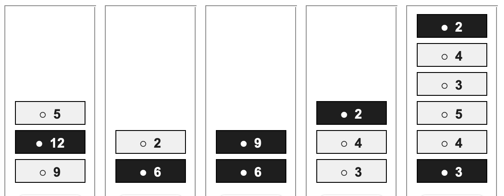
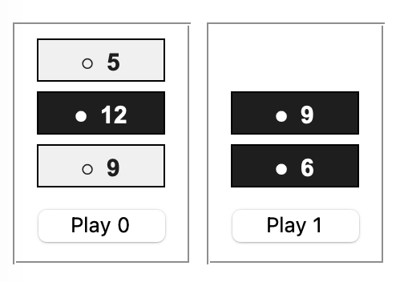

# Assignment 1: Heap Go Game

## Implement Rules and Random Player

- Due: Sep 21, 23:55pm. Submit here on Canvas.
- Responsible TA for this assignment: Parash (see teaching team page)

## Resources

- Starter code: assignment1.tgzDownload assignment1.tgz, decompress with tar -xvzf assignment1.tgz
- Read this first: Rules and Policies for all assignments
- Read this next: Rules of Heap Go
- Assignment 1 preview slidesDownload Assignment 1 preview slides from class
- SSH connection guide - connect to UCOMM machines (required for testing your code)
- Assignment 1 FAQ: Input Format and Parsing

## Assignment 1 Specification

Write a python3 program for Heap Go based on our a1.py starter code from assignment1.tgz.

### Heap Go restrictions for this assignment

- At the start of each game:
  - The number of heaps is between 1 and 10 (inclusive)
  - Each heap contains from 1 to 10 tokens (inclusive)
  - Each token (c, n) has color c, either 'b' or 'w', and value n, an integer between 1 and 20 (inclusive).
  - The komi is an integer + 0.5 to avoid draws. Initialise Black's score to 0, and White's score to the komi. Range: -100 < komi < +100

### Text Commands and Answers

We will test your program using the text commands below. For each command there is an empty function in the starter code, that does nothing useful. You need to implement these commands as indicated below. Commands and answers use the following general format:

command
output (0 or more lines, depending on command)
= 1

Here, the last line = 1 after  the output is the command status. 1 indicates that the command was successfully executed. If there was any kind of error, then instead write a command status

= -1

There are a few examples in the public test cases (see below). But be very careful in checking for valid input - our private test cases will contain many more stress-testing examples of both valid and invalid inputs.

### List of Commands

For all commands, see the public test cases for examples and formatting details.

    heapgo komi G

Start a new Heap Go game. Komi is a number. G is a text string specifying the game. By default, 'b' plays first, but this can be changed anytime by the toplay command.

    show

Show the komi and the current game state

    toplay color

Set the current player to color b or w

    play heap_number

Play a move for current toplay on the given heap_number. Heaps in the current game are numbered left to right, 0, 1, ....

    legal heap_number

Check if this move is legal. Output yes or no. The command status is = 1 if heap_number is valid input, defined here as some nonnegative integer.

    genmove

Generate and play a random move. Output the heap_number of your move. If there is no move left, do nothing and return an error status.

    score

Output the current score (including komi)

    winner

If the game is over, output the winner b or w. If the game is not over, return an error status.

## Testing

We use both public and private test cases to assess your a1.py program. The public test cases are in assignment1.tgz file assignment1-public-tests.txt. Each command is followed by the expected correct answer and command status on the next lines.

Follow the steps below on a standard Linux undergraduate machine, and create a text file test.log that shows a copy of your command line presubmission testing.

    Make sure the content of your assignment1 folder is correct, then create your submission with a command such as tar -cvzf assignment1.tgz assignment1
    Use the Linux script command to log your testing session
    Copy and unpack your assignment1.tgz in a new directory
    Run the test script python3 ./a1test.py , using your program a1.py and the test file assignment1-public-tests.txt as input:

    python3 a1test.py a1.py assignment1-public-tests.txt

    Stop script logging here with the command exit
    Create and add file test.log to your assignment1, and compress it again
    Use tar -tf for a final check of your assignment1.tgz contents. Use the checklist below
    If you see extra files included in your tgz file that do not belong:
        Use tar options such as --exclude=__pycache__ to get rid of them.
    Fix any problems, then submit here when you're ready

## Submission

Group leaders only: submit a single tgz compressed file called assignment1.tgz which contains exactly the following (and nothing else):

A single directory assignment1 which contains all the files in your solution, namely:

    All the files from the original assignment1 directory, but with the python code in a1.py modified to solve the assignment.
    Your test.log file.
    A file readme.txt which lists the names and student IDs of your team, group leader first.

    Note added Sep 11, 2026: Canvas may modify the file name that you used:  In case of re-submissions it seems to add a version number. We will deal with that on our end. You should just submit using the regular name assignment1.tgz, even if you re-submit.

## Marking

There will be total of 5 marks for this assignment.

    1 mark for your file test.log which shows the log of your correct test execution on a standard Linux undergraduate machine, and your readme.txt file (see above).
    1 mark for passing our public test cases
    1 mark for code quality. More details on page: all assignments - rules and policies
    2 marks for passing our private test cases

Code that does not run, or just hardcodes answers to public test cases, will receive a mark of 0. If your code needs fixes, you need to submit a revised version before the submission deadline. TA will not attempt to fix your code under any circumstances. Use the discussion forum or consult the teaching team in case of questions.

## Assignment 1 FAQ: Input Format and Parsing

### 1. Which Python version is used for testing?
The default version on almost all lab machines is 3.8.10, so that is what we will use for testing

### 2. Is input case-sensitive? I.e. should B and b be treated as the same?
A. Yes, colors are case-sensitive.

    b and w are valid.
    B, W, black, and white are invalid.
    Command names are also case-sensitive.

### 3. Is arbitrary whitespace between arguments allowed? For example, should the following be considered valid input? heapgo    3.5    [ [('       b ', 5)] ]
A. Whitespaces between parameters get stripped by the starter code and is considered legal. However, whitespaces inside quotes are considered part of the string so '   b  ' is considered invalid.

### 4. Is .5 or -.5 a valid komi value?
A. You do not have to worry about this edge case as it will not be tested.

### 5. If the previous heapgo game has not finished, and user enters a new invalid heapgo command, should the previous valid game remain active, or should the program be considered to have no current valid game?
A. Previous game state should remain intact.

### 6. Should command "toplay color" return -1 if a game has finished (no legal move left)?
A. No, as mentioned in the assignment specification, the player "can be changed anytime" after the creation of the game.

### 7. If no valid game has been created yet, should all other commands return = -1?
A. Yes, all commands except for game initializer should return -1 command status

## Rules of Heap Go

Heap Go is a two player game which is a very simplified model of Go endgames. 

The players are Black 'b'  and White 'w'. At the start of a game, there are one or more heaps, which contain one or more tokens each. Each token is represented by a tuple (c, n) with color c ('b' or 'w') and value n, a positive integer. 

The figure shows a Heap Go position with five heaps and tokens of both colors.

To make a move, a player takes one or more tokens from a single non-empty heap, according to the rules below. The player receives the values of all these tokens and adds them to their score.

The game is over when all heaps are empty. To win the game, collect a higher score than the opponent.

Going first is often an advantage. As in Go, to balance the game, the white player receives a komi, a real number which is added to their score. If the komi is an integer, then draws are possible. Komi can be negative.

A heap can be represented by a list of tokens. Tokens are always taken from the top, the end of the list.

Example of a game G with two heaps. The first heap has three tokens, the second heap has two, and komi = 0.5.

G = [ [('w', 9), ('b', 12), ('w', 5)],  [('b', 6), ('b', 9)] ]

### How to move - Details

First, the player to play next (Black or White) selects a non-empty heap. Then, the player takes one or more tokens from this heap, from the top, as follows:

    Take all the tokens of their own color (take zero or more tokens in this step)
    Then, if the heap is still not empty: one token of the opponent's color (take zero or one more token)

Example: in game G above, if Black is to play:

There are two non-empty heaps, so Black has two possible moves from G:

    Take from the first heap: the top token ('w', 5) is the opponent's, so the player cannot take any own tokens by rule 1. The player simply takes this top token by rule 2. Black adds 5 to their score, and the game is changed to [ [('w', 9), ('b', 12)],  [('b', 6), ('b', 9)] ]
    Take from the second heap: the top two tokens are both the player's color. So Black takes both for a score of 9+6 = 15. This heap is now empty so rule 2 does not apply. The game after this move is [ [('w', 9), ('b', 12), ('w', 5)],  [ ] ]

Another example: in the same game G, but with White to play: white's moves are either:

    take two from the first heap, score 5+12=17, remaining game  [ [('w', 9)],  [('b', 6), ('b', 9)] ]
    or take one from the second heap, score 9, new game [ [('w', 9), ('b', 12), ('w', 5)],  [('b', 6)] ]

### End of game

Compare the score of both players, including komi for white. The player with larger score is the winner. If both have the same score, its a draw.
